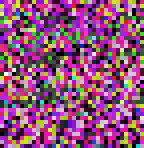

`string2png` is a small, flexible utility to compile strings to PNG images files.
It is intended to ease the creation of extremely low resolution graphical assets
such as gradient and patterns. It may also be used for abstract data visualization,
glitch art and basic steganography.

# Installation

``` sh
npm install -g string2png
```

# Examples

*Note: All images have been enlarged to ease viewing. Actual output is miniscule.*

## rgb

Simple 3-pixel png
``` sh
string2png  ff0000 00ff00 0000ff -o example/rgb.png
```


## checkerboard

Checkboard pattern
``` sh
string2png --encoding hex2 --width 2 --channels v f00f -o example/checkerboard.png
```


## glitch

This page as glitch.
``` sh
string2png --input README.md --square --normalize 1 --encoding ascii --background red --channels hsv --output example/readme.png
```



See [example/README.md](example/README.md) for more examples.


# Usage

## Javascript

``` js
const string2png = require('string2png')

// Default options
const options = {
  encoding: 'hex',
  channels: 'rgb',
  width: 0,
  height: 0,
  background: 'rgba(0,0,0,1)'
}

// Write to a PNG file
string2png.output( 'ff0000 00ff00 0000ff', 'outputfile.png', options )
  .then( () => console.log('Wrote file') )

// Return PNG as buffer
let buffer = string2png.png( 'ff0000 00ff00 0000ff', options )

// Return PNG as data URI
let data = string2png.datauri( 'ff0000 00ff00 0000ff', options )  

// Get normalization parameters
let { data, measured } = await string2png( {
  input: 'yourdatafile.csv',
  encoding: 'float',
  normalize: 6,
  measure: true,
  channels: 'v',
})
```


## Command line

By default, the utility `string2png` will output a data URI string to stdout. To
output a file, use the `--output` or `-o` option. Any non-options on the command
line will be appended to stdin and used as input data.

Make a single green pixel by piping stdin:
``` sh
echo 00ff00 | string2png
```

# Options


### encoding

- **hex** *default* - Parse hexadecimal data like CSS colours. All non-hex input will be ignored. Example: `ff0000`
- **hex2** - Parse CSS-style short hex data. Each hex digit will be a single value. Example: `f00`
- **float** - Search input data for all substrings that look like numbers. Any delimiter maybe be used. Example: `0.5 0 0 - CSS maroon`
- **percent** - Like `float`, except divide by `100`. Example: `0 100% 100 - CSS Aqua`
- **decimal** -  Like `float`, except divide by `255`. Example: `220,20,60 - CSS Crimson`
- **ascii** - Interpret data as 8 bit binary.

### channels

A string or array list of colour channels to be interpreted from input, in the order they are to be parsed. The default is
`rgb`. Supported channels are `rgba` and `hsv`. See [examples](example/README.md) for many different usages of the `channels` option.  

Any unrecognized channel will be parsed and thrown out, allowing padding within data.

### data

String containing data to be processed.

### input

Load any number of files or urls, and append to data. URLs will be loaded with the [request](https://npmjs.org/package/request) module. 

### width

The width, in pixels, of the output file. If `width` is not specified, it will default to
the length of parsed colour data, giving a `height` of `1`. If `width` is specified, the
length of data will be rounded up to the nearest divisor of `width` by padding with `background`
to ensure a rectangular output.

### height

If `height` is specified, the output will be cropped or padded.

### square

If specified, `width` and `height` will be set to the square root of data length, providing a roughly square output.

### background

The default value to use for pixel output. Any CSS string may be used. This colour
value can be altered by input data on a channel-by-channel basis. See example [alter-red](example/README.md#alter-red)

### raw

Dump data to `stdout` as binary, rather than datauri. Does not affect `output`.

### normalize

Specify number of columns to normalize. Each column will be normalized separately, mapping to a 0-1 range. Normalization is applied before `channels`. Best used with float `encoding`.

### measure

Output normalization parameters to a JSON file from command line.