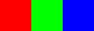

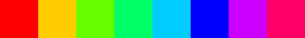
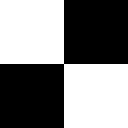
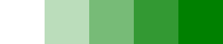
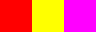
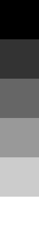
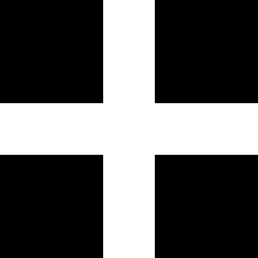

# Examples

*Note: All images have been scaled up 64x to ease viewing. This file is
auto-generated by ../src/buildExamples.js*
## rgb

Simple 3-pixel png
``` sh
string2png  ff0000 00ff00 0000ff -o example/rgb.png
```



## blank

Single, transparent pixel
``` sh
string2png --width 1 --height 1 --background transparent  -o example/blank.png
```



## rainbow

Create an HSV rainbow using the 'h' channel
``` sh
string2png --encoding hex2 --channels h --background red 02468ace -o example/rainbow.png
```



## checkerboard

Checkboard pattern
``` sh
string2png --encoding hex2 --width 2 --channels v f00f -o example/checkerboard.png
```



## alpha

Transparency using the 'a' channel
``` sh
string2png --encoding hex2 --channels a --background green 048cf -o example/alpha.png
```



## alter-red

Use 'gb' channels to alter a red background. Input pixels are 2 bytes each.
``` sh
string2png --background red --channels gb 0000 ff00 00ff -o example/alter-red.png
```



## grayscale

Use percent encoding to make a vertical gray scale.
``` sh
string2png --encoding percent --channels v --width 1 0 20 40 60 80 100 -o example/grayscale.png
```



## grid

Simple tilable 5x5 grid pattern.
``` sh
string2png --encoding float --channels v --width 5 data starts here - 0 0 1 0 0  0 0 1 0 0  1 1 1 1 1  0 0 1 0 0  0 0 1 0 0 -o example/grid.png
```

