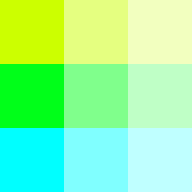
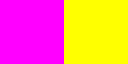
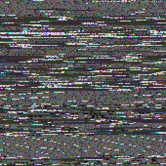
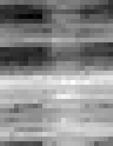

# Examples

*Note: All images have been enlarged to ease viewing. This file is
auto-generated by ../src/buildExamples.js*

## rgb
 Simple 3-pixel png
``` sh
string2png  ff0000 00ff00 0000ff -o example/rgb.png
```


## blank
 Single, transparent pixel
``` sh
string2png --width 1 --height 1 --background transparent  -o example/blank.png
```


## rainbow
 Create an HSV rainbow using the 'h' channel
``` sh
string2png --encoding hex2 --channels h --background red 02468ace -o example/rainbow.png
```


## checkerboard
 Checkboard pattern
``` sh
string2png --encoding hex2 --width 2 --channels v f00f -o example/checkerboard.png
```


## alpha
 Transparency using the 'a' channel
``` sh
string2png --encoding hex2 --channels a --background green 048cf -o example/alpha.png
```


## alter-red
 Use 'gb' channels to alter a red background. Input pixels are 2 bytes each.
``` sh
string2png --background red --channels gb 0000 ff00 00ff -o example/alter-red.png
```


## grayscale
 Use percent encoding to make a vertical gray scale.
``` sh
string2png --encoding percent --channels v --width 1 0 20 40 60 80 100 -o example/grayscale.png
```


## hueSat
 Box made of various hue and saturation value.
``` sh
string2png --background white --encoding percent --channels hs --width 3 20 100  20 50  20 25   35 100  35 50  35 25   50 100  50 50  50 25 -o example/hueSat.png
```



## grid
 Simple tilable 5x5 grid pattern.
``` sh
string2png --encoding float --channels v --width 5 data starts here - 0 0 1 0 0  0 0 1 0 0  1 1 1 1 1  0 0 1 0 0  0 0 1 0 0 -o example/grid.png
```


## ignore
 Use null channels to ignore extraneous data.
``` sh
string2png --channels rgb000 ff00ffEEEEEE ffff00EEEEEE -o example/ignore.png
```



## readmeneon
 README.md as neon glitch.
``` sh
string2png --input README.md --square 1 --normalize 1 --encoding ascii --background red --channels hsv  -o example/readmeneon.png
```


## wikienglish
 Download english wikipedia page and make noise square.
``` sh
string2png --input https://en.wikipedia.org/wiki/Main_Page --square 1 --channels rgb --encoding ascii  -o example/wikienglish.png
```


## wikikartoli
 Same thing with Kartoli wikipedia page. Notice unicode characters appearing as highlights.
``` sh
string2png --input https://ka.wikipedia.org/wiki/%E1%83%9B%E1%83%97%E1%83%90%E1%83%95%E1%83%90%E1%83%A0%E1%83%98_%E1%83%92%E1%83%95%E1%83%94%E1%83%A0%E1%83%93%E1%83%98 --square 1 --channels rgb --encoding ascii  -o example/wikikartoli.png
```



## weather
 Visualization of weather data, using normalization and selection of a single column from three column original data. See [../test/hourly.tsv](../test/hourly.tsv) for input.
``` sh
string2png --input test/hourly.tsv --width 24 --channels vEE --normalize 3 --measure 1 --encoding float  -o example/weather.png
```


Normalization parameters output:
 ``` json
[[-5,-14.399999618530273,28],[10.600000381469727,9.100000381469727,98]]
```
